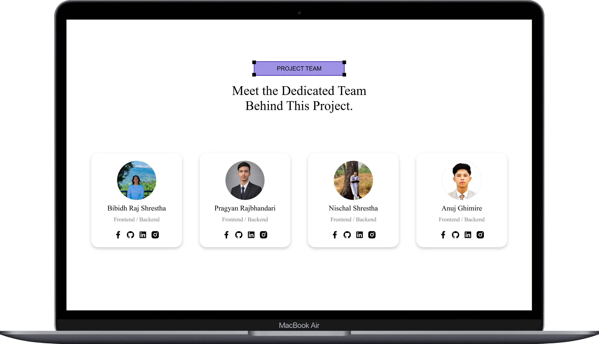
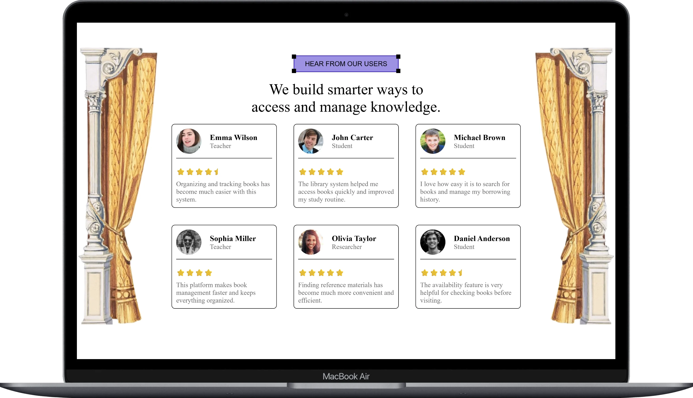
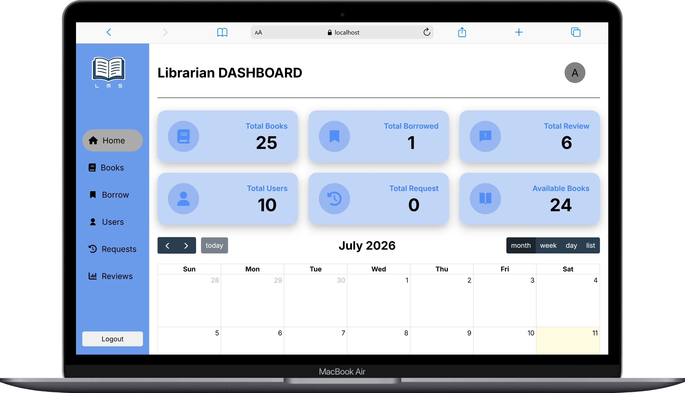
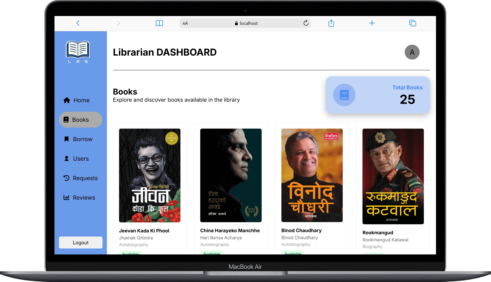
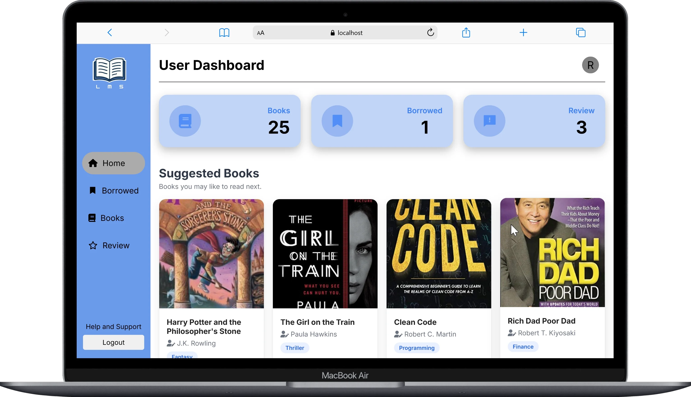
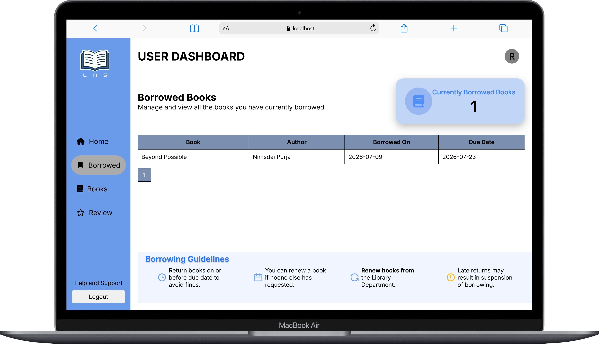

<p id="top"></p>

# 📚 Library Management System

<p align="center">
  
  
  
  
  
</p>

---

## 📖 About the Project

The **Library Management System (LMS)** is a web-based application developed to simplify and automate library operations. The system provides separate interfaces for administrators and users, enabling efficient management of books, borrowing activities, user accounts, and reviews.

The project was developed as a collaborative team project using **HTML, CSS, JavaScript, PHP, and MySQL**.

---

## 👨‍💻 Team Members

<p align="center">

<br/><br/>

<a href="https://github.com/anujghimire08">
<br/>
<b>Anuj Ghimire (Team Leader)</b><br/>
Frontend • Backend • UI/UX
</a>

<br/><br/>

<a href="https://github.com/Bibidh-Raj-Shrestha">
<br/>
<b>Bibidh Raj Shrestha</b><br/>
Frontend • Backend • UI/UX
</a>

<br/><br/>

<a href="https://github.com/pragyanrajbhandari">
<br/>
<b>Pragyan Rajbhandari</b><br/>
Frontend • Backend • UI/UX
</a>

<br/><br/>

<a href="https://github.com/nischalshrestha0011">
<br/>
<b>Nischal Shrestha</b><br/>
Frontend • Backend • UI/UX
</a>

</p>

---

## 🎯 Objectives

- Digitize library management processes.
- Simplify book borrowing and returning.
- Maintain centralized records of books and users.
- Provide secure authentication for administrators and users.
- Improve efficiency by reducing manual record keeping.

---

## 🎓 Academic Information

| Item                 | Description                       |
| -------------------- | --------------------------------- |
| **Project Name**     | Library Management System         |
| **Project Type**     | Team Project                      |
| **Technology Stack** | HTML, CSS, JavaScript, PHP, MySQL |
| **Database**         | MySQL                             |
| **Server**           | Apache (XAMPP)                    |

---

# ✨ Features

## 👤 Authentication

- User Registration
- User Login
- Logout
- Session Management
- Password Hashing
- Account Approval by Administrator

---

## 📚 Book Management

Administrator can:

- Add Books
- Update Book Information
- Delete Books
- View All Books
- Search Books

User can:

- Browse Available Books
- Search Books
- View Book Details

---

## 🔄 Borrow Management

- Borrow Book Request
- Borrow Request Approval
- Borrow Status Tracking
- Return Book Management
- Borrow History

---

## 👥 User Management

Administrator can:

- View Registered Users
- Approve User Accounts
- Manage User Information

---

## ⭐ Review System

- Submit Book Reviews
- View Reviews
- Manage Reviews

---

## 📊 Dashboard

### Administrator Dashboard

- Total Books
- Total Users
- Borrow Statistics
- Pending Requests
- Recent Activities

### User Dashboard

- Available Books
- Borrowed Books
- Borrow Status
- Reviews

---

## 🔒 Security Features

- Role-Based Access Control
- Session Authentication
- Password Hashing
- Prepared SQL Statements
- Input Validation

---

# 🛠️ Technologies Used

| Technology     | Purpose                   |
| -------------- | ------------------------- |
| HTML5          | Structure                 |
| CSS3           | Styling                   |
| JavaScript     | Client-side Interactivity |
| PHP            | Backend Development       |
| MySQL          | Database                  |
| Apache (XAMPP) | Local Server              |

---

# Preview

| Landing Page                   |
| ------------------------------ |
|    |
|    |
|  |

| Administrator Dashboard       |
| ----------------------------- |
|  |
|  |

| User Dashboard                 |
| ------------------------------ |
|    |
|  |

---

# 📂 Project Structure

```text
📦 LibraryManagementSystem
 ┣ 📂assets
 ┃ ┣ 📂books
 ┃ ┃ ┣ 📜1984.jpg
 ┃ ┃ ┣ 📜algorithm.jpg
 ┃ ┃ ┣ 📜atomic.jpg
 ┃ ┃ ┣ 📜beyondpossible.jpg
 ┃ ┃ ┣ 📜binod.jpg
 ┃ ┃ ┣ 📜bravenewworld.jpg
 ┃ ┃ ┣ 📜chinaharayeko.jpg
 ┃ ┃ ┣ 📜cleancode.jpg
 ┃ ┃ ┣ 📜deepwork.jpg
 ┃ ┃ ┣ 📜girlsontrain.jpg
 ┃ ┃ ┣ 📜harrypotter.jpg
 ┃ ┃ ┣ 📜ikigai.jpg
 ┃ ┃ ┣ 📜jeevankada.png
 ┃ ┃ ┣ 📜mahabir.jpeg
 ┃ ┃ ┣ 📜makeyourbed.jpg
 ┃ ┃ ┣ 📜nepathya.jpg
 ┃ ┃ ┣ 📜neverfinished.jpg
 ┃ ┃ ┣ 📜PrideandPrejudice.jpg
 ┃ ┃ ┣ 📜psychologymoey.jpg
 ┃ ┃ ┣ 📜richdad.jpg
 ┃ ┃ ┣ 📜rookmangud.jpg
 ┃ ┃ ┣ 📜shutterisland.jpg
 ┃ ┃ ┣ 📜TheDaVinciCode.jpg
 ┃ ┃ ┣ 📜thinkrich.jpg
 ┃ ┃ ┗ 📜thniklikemonk.jpg
 ┃ ┣ 📜admin-book.webp
 ┃ ┣ 📜admin-home.webp
 ┃ ┣ 📜defaultprofile.jpg
 ┃ ┣ 📜growth.png
 ┃ ┣ 📜headerbg.jpg
 ┃ ┣ 📜home-hero.webp
 ┃ ┣ 📜home-review.webp
 ┃ ┣ 📜home-team.webp
 ┃ ┣ 📜left.png
 ┃ ┣ 📜loginbg.jpeg
 ┃ ┣ 📜logo.png
 ┃ ┣ 📜lsmhome.gif
 ┃ ┣ 📜lsmpreview.mp4
 ┃ ┣ 📜manage.png
 ┃ ┣ 📜milestonevideo.mp4
 ┃ ┣ 📜registerbg.jpg
 ┃ ┣ 📜right.png
 ┃ ┣ 📜user-borrow.webp
 ┃ ┗ 📜user-home.webp
 ┣ 📂Documentation
 ┃ ┣ 📜Library Management System.docx
 ┃ ┗ 📜x.excalidraw
 ┣ 📂frontend
 ┃ ┣ 📂Auth
 ┃ ┃ ┣ 📜login.php
 ┃ ┃ ┣ 📜logout.php
 ┃ ┃ ┗ 📜register.php
 ┃ ┣ 📂css
 ┃ ┃ ┣ 📜admin.css
 ┃ ┃ ┣ 📜index.css
 ┃ ┃ ┣ 📜login.css
 ┃ ┃ ┣ 📜register.css
 ┃ ┃ ┗ 📜user.css
 ┃ ┣ 📂dashboard
 ┃ ┃ ┣ 📂admin
 ┃ ┃ ┃ ┣ 📜books.php
 ┃ ┃ ┃ ┣ 📜borrow.php
 ┃ ┃ ┃ ┣ 📜home.php
 ┃ ┃ ┃ ┣ 📜request.php
 ┃ ┃ ┃ ┣ 📜return.php
 ┃ ┃ ┃ ┣ 📜reviews.php
 ┃ ┃ ┃ ┗ 📜users.php
 ┃ ┃ ┗ 📂user
 ┃ ┃ ┃ ┣ 📜books.php
 ┃ ┃ ┃ ┣ 📜borrowed.php
 ┃ ┃ ┃ ┣ 📜home.php
 ┃ ┃ ┃ ┣ 📜review.php
 ┃ ┃ ┃ ┗ 📜status.php
 ┃ ┣ 📂includes
 ┃ ┃ ┣ 📂navbars
 ┃ ┃ ┃ ┣ 📜admin_navbar.php
 ┃ ┃ ┃ ┗ 📜user_navbar.php
 ┃ ┃ ┣ 📜borrow_guidelines.php
 ┃ ┃ ┣ 📜db.php
 ┃ ┃ ┗ 📜event.php
 ┃ ┗ 📂script
 ┃ ┃ ┣ 📜admin.js
 ┃ ┃ ┗ 📜user.js
 ┣ 📜index.php
 ┗ 📜Readme.md
```

---

# 🚀 Getting Started

## Requirements

- PHP 8+
- MySQL
- Apache (XAMPP)

## Installation

1. Clone the repository.

```bash
git clone https://github.com/anujghimire08/LibraryManagementSystem
```

2. Move the project into the **htdocs** directory.

3. Start **Apache** and **MySQL** from XAMPP.

4. Import the provided **lms.sql** file into phpMyAdmin.

5. Open your browser and visit:

```
http://localhost/LibraryManagementSystem
```

---

# 📸 System Modules

- Landing Page
- Login
- Registration
- Admin Dashboard
- User Dashboard
- Book Management
- User Management
- Borrow Request
- Borrow Records
- Return Management
- Reviews
- Account Approval

---

# 🤝 Team Contribution

This project was completed collaboratively. Every team member contributed to the planning, design, development, testing, and documentation of the Library Management System.

---

# 📄 License

This project was developed for academic purposes.

---

<p align="center">
⭐ If you found this project useful, consider giving it a star!
<br><br>
Built with ❤️ by our team.
</p>

<p align="center">
<a href="#top">⬆ Back to Top</a>
</p>
